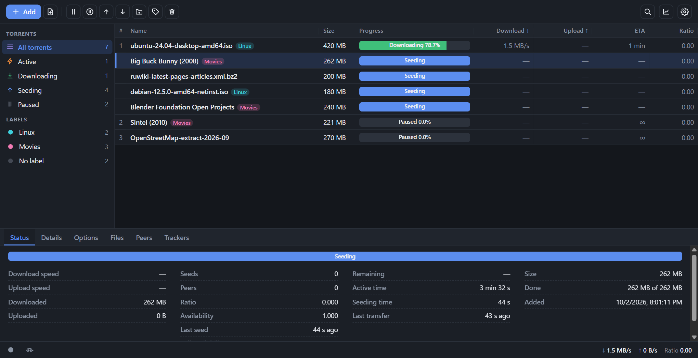
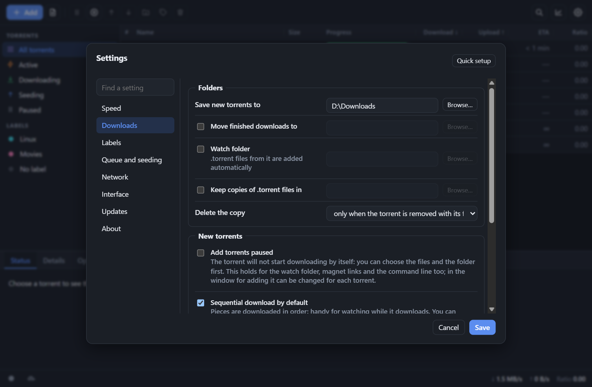
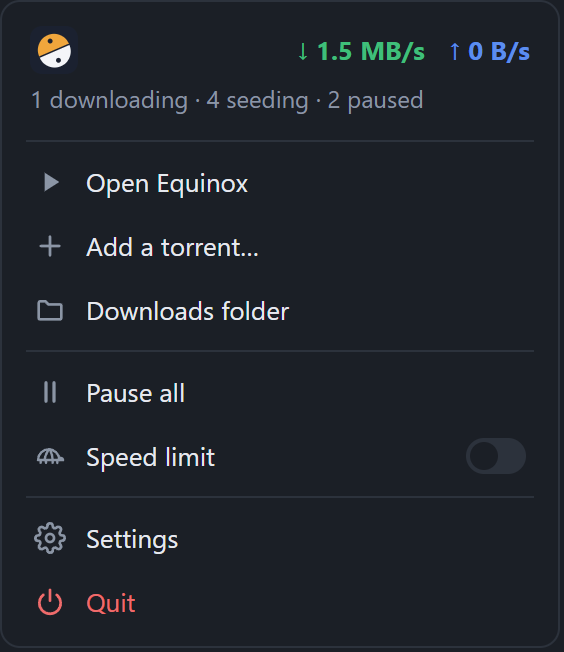

#  Equinox

[](https://github.com/Ozzvin/equinox/releases/latest)
[](https://github.com/Ozzvin/equinox/actions/workflows/test.yml)
[](LICENSE)

**A BitTorrent client for Windows: light, fast, and ready to use without any setup.**

[Русская версия](README.md)

Equinox is a BitTorrent client for Windows. The engine is written in Go ([anacrolix/torrent](https://github.com/anacrolix/torrent)), the web interface is built into the program, and it comes with a window and a tray icon. It works like an ordinary application: download it, run it, no keys or server settings needed. The interface is available in Russian and English (Settings → Interface → Language; by default it follows the system language).

## What it looks like

<p align="center"></p>

<p align="center">
  
  &nbsp;
  
</p>

## Features

**Torrents**
- Add by magnet link or `.torrent` file (including drag and drop and "Open with"), create your own `.torrent` files, a watch folder.
- Choose files and set a priority for each one, sequential download, first and last pieces of a file first.
- A file link for a media player: watch video and listen to music while it downloads.
- Manual peers: an address like `ip:port`, `[ipv6]:port` or `name:port`. They are remembered and tried again after a restart; if a peer has been unreachable for a long time, the program offers to remove it.
- Large torrents start at once: files are created sparse, so Windows does not fill them with zeros first.

**Queues and limits**
- A download queue with a limit of simultaneous downloads; a limit of simultaneous seeds (the extra ones wait, and those that have someone to upload to go first); file checks with a limit of simultaneous checks and storage moves with a limit of simultaneous moves.
- Speed limits, a "turtle" mode with a schedule, ratio and seeding-time limits (global and per torrent).

**Network**
- UPnP / NAT-PMP port forwarding with a status check and hints, DHT, PEX, uTP, encryption, IPv6.
- The port indicator's tooltip shows your external address, and the Peers tab shows the number of connected peers.

**Keeping the list in order**
- Labels with their own folders and colors, search, filters by state and tracker, configurable columns, statistics.
- Three interface densities (including a compact mode without the side panel), and a dark, light or system theme.

**Windows**
- A tray menu in the style of the application: live speed and counters, pause or resume everything, the speed limit, add a torrent, open the downloads folder. A left click on the icon shows the window and hides it again.
- Notifications, autostart (including a quiet one, into the tray), opening magnet links and `.torrent` files by default.
- Auto-update: the program checks for a new version every 15 minutes, verifies the checksum of the installer and updates itself with a restart.
- Its own storage: files are not locked for other programs, and a torrent can be removed or moved on the fly.

**Settings**
- Compact rows, a tick box that turns on an optional folder or limit, a search across all settings and a "reset the section to the defaults" button.

## Installation

Download the file you need from the [Releases](https://github.com/Ozzvin/equinox/releases) page:

| File | What it is |
|---|---|
| `Equinox-Setup-<version>.exe` | the installer; by default it installs for the current user, without administrator rights |
| `Equinox-pc-<version>.zip` | a portable desktop version: window and tray, no installation needed |
| `Equinox-server-<version>.zip` | a server version without a window: the interface opens in a browser |

The installer can also be run "for all users" (a choice on its first page, or run it as administrator): the program is then placed in `Program Files`, and auto-update asks for confirmation in a Windows window (UAC).

The release also contains `Equinox-Setup.exe`: the same installer under its former name, which already installed versions need in order to update themselves. You do not need to download it by hand.

Requires Windows 10/11 and the Microsoft Edge WebView2 Runtime (it is part of Windows 11 and most Windows 10 installations; only the desktop version needs it).

The data (settings, the list of torrents, copies of `.torrent` files, the log) is kept in the `data` folder next to the program (when installed in `Program Files`, in `%LOCALAPPDATA%\Equinox`). To move everything to another computer, copy the whole folder.

> The builds are not signed, so Windows SmartScreen may show a warning on the first start: "More info" → "Run anyway".

## Building from source

You need Go 1.27+ and, for the installer, [Inno Setup 6](https://jrsoftware.org/isinfo.php).

```powershell
git clone https://github.com/Ozzvin/equinox.git
cd equinox
.\build.ps1              # checks, tests, build, installer and archives in the dist folder
.\build.ps1 -SkipTests   # the same without the tests
```

By hand:

```powershell
go build -ldflags "-H windowsgui -s -w" -o Equinox.exe ./cmd/equinox   # desktop
go build -o Equinox-server.exe ./cmd/equinox-server                    # server
go test ./...
```

Releases are built by GitHub Actions (the "Build" workflow); tests with the race detector run on every commit to `main` and `dev`.

## Security

The API listens on `127.0.0.1` only and requires an access key (`data/api-token`). Do not show this file to anyone. Access from other devices is not supported yet.

## Documentation

The documents below are in Russian.

- [docs/details.md](docs/details.md): a detailed description of the interface.
- [docs/architecture.md](docs/architecture.md): how the project is built, for those who will change the code.
- [CHANGELOG.md](CHANGELOG.md): the history of changes.

## License

[MIT](LICENSE)
